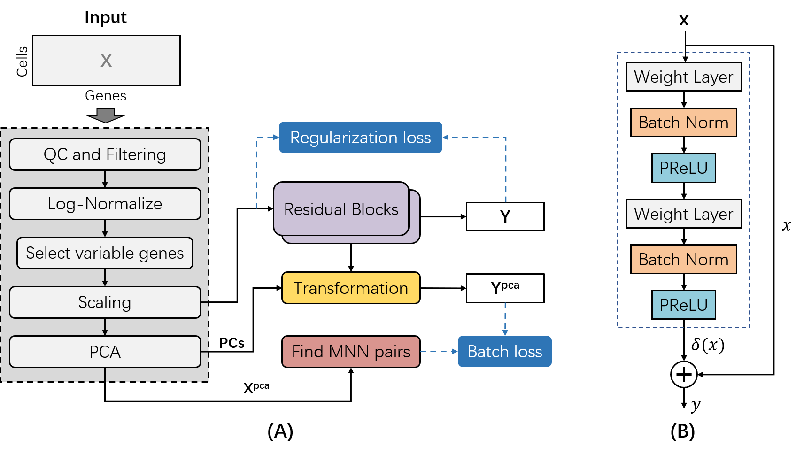

# deepMNN

## Introduction
deepMNN is a deep learning-based method to correct batch effect in scRNA-seq data, which is described in the paper "deepMNN: deep learning-based single-cell RNA sequencing data batch correction using mutual nearest neighbors" by Bin Zou, Tongda Zhang, Ruilong Zhou, Xiaosen Jiang, Huanming Yang, Xin Jin, and Yong Bai. This repository contains the deepMNN source code as well as scripts necessary for reproducing the results in the paper.
